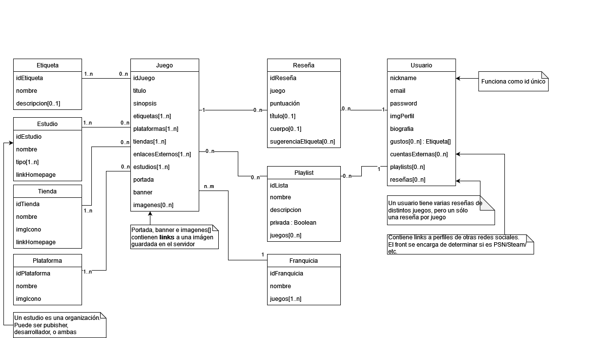
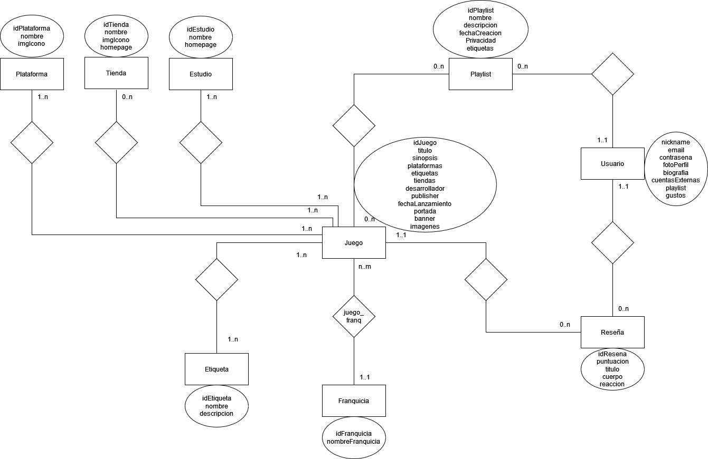

# Propuesta TP DSW
## Grupo
### Integrantes
- 51537 - [Cabanellas, Miguel](https://github.com/maig0l)
- 51085 - [Casado, Luciano Agustín](https://github.com/luchocsd)
- 44771 - [Salvia, Ricardo Tomas](https://github.com/rst5150)

### Repositorios
- [Frontend app](https://github.com/maig0l/utn-dsw-front)
- [Backend app](https://github.com/maig0l/utn-dsw-back)

## Tema
### Descripción
Un repositorio de reseñas de videojuegos. Un usuario puede opinar sobre un juego dándole una puntuación en una escala de 0 a 5 estrellas, con opción a dejar un comentario escrito sobre un título. Los usuarios pueden crear listas de juegos relacionados a su parecer (similar a una *playlist*). El sistema también hace recomendaciones automatizadas basándose en etiquetas asociadas a los juegos. Finalmente, la web muestra información sobre los juegos como las plataformas soportadas y tiendas donde se encuentran.

### Modelos
#### Diagrama de clases

#### Diagrama Entidad-Relación

## Alcance funcional
### Alcance mínimo

|Req|Detalle|
|:-|:-|
| CRUD simple       | 1. CRUD Usuario |
|                   | 2. CRUD Etiqueta |
|                   | 3. CRUD Plataforma|
| CRUD dependiente  | 1. CRUD Juego (depende de CRUDs Etiqueta, Estudio, Tienda y Plataforma) |
|                   | 2. CRUD Franquicias (depende de CRUD Juego) |
|                   | 3. CRUD Playlist (depende de CRUD Usuario) |
| Listado + detalle | 1. Listar juegos por plataformas/etiquetas/desarrollador/publisher/franquicia, muestra nombre y puntuación promedio |
|                   | 2. Listado de juegos filtrado por nombre, muestra nombre y puntuación promedio (búsqueda de juegos) |
|                   | 3. Listado de juegos filtrado por rango de fecha y rango de puntuación promedio, muestra nombre, fecha lanzamiento, puntuación promedio, ordenado por puntaje |
|                   | 4. Listado de reseñas de un juego filtrado por rango de puntajes |
| CUU/Epic          | 1. Escribir una reseña |

### Adicionales para Aprobación Directa
|Req|Detalle|
|:-|:-|
|CRUD     | 1. CRUD Tienda |
|         | 2. CRUD Estudio |
|CUU/Epic | 1. El sistema ofrece recomendaciones de juegos al usuario en base a las etiquetas relacionadas y sus gustos |